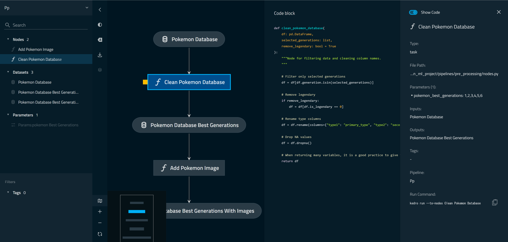
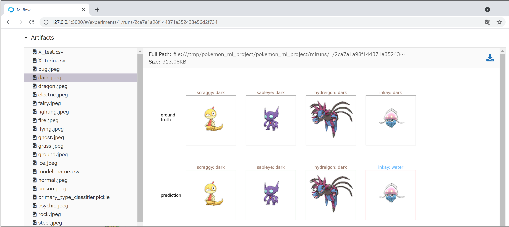

# pokemon_ml_project

## Init Project

```
$ git clone https://github.com/naotor/pokemon_ml_project
$ cd pokemon_ml_project

$ poetry install
$ poetry shell
$ cd pokomon_ml_project

$ kedro install
```

## Run Pipeline

```
$ kedro run
$ open data/08_reporting/
```

View Prediction of Pokemon list by Type.

## View Pipeline

```
$ kedro viz
```




## Open MLFlow

```
$ kedro mlflow ui
```


